# Blueprint Tips

Algunos tips para hacer la vida más fácil al usar Blueprints.

- [Blueprint Tips](#blueprint-tips)
  - [1. Crear Nodo Branch rápido](#1-crear-nodo-branch-rápido)
  - [2. Crear Nodo Sequence rápido](#2-crear-nodo-sequence-rápido)
  - [3. Crear Nodo Delay rápido](#3-crear-nodo-delay-rápido)
  - [4. Crear Setter y Getter más rápido](#4-crear-setter-y-getter-más-rápido)
  - [5. Esconder Pins no conectados de un Struct](#5-esconder-pins-no-conectados-de-un-struct)
  - [6. Drag para asignar Categoría](#6-drag-para-asignar-categoría)
  - [7. Transfer Pins](#7-transfer-pins)
  - [8. Reemplazar variable por otra](#8-reemplazar-variable-por-otra)
  - [9. Convertir a Validated Get](#9-convertir-a-validated-get)
  - [10. Cambiar Cast a nodo Puro](#10-cambiar-cast-a-nodo-puro)
  - [11. Llamar misma función en múltiples objetos](#11-llamar-misma-función-en-múltiples-objetos)
  - [12. Llamar función en todos los objetos de un Array](#12-llamar-función-en-todos-los-objetos-de-un-array)
  - [13. Crear Input Parameter en función arrastrando pin](#13-crear-input-parameter-en-función-arrastrando-pin)
  - [14. Crear Output en función arrastrando pin](#14-crear-output-en-función-arrastrando-pin)
  - [15. Múltiples nodos return](#15-múltiples-nodos-return)

## 1. Crear Nodo Branch rápido
    
Mantener presionado **B** y hacer **left click** en el graph

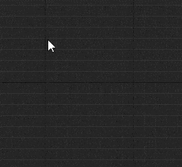

## 2. Crear Nodo Sequence rápido

Mantener presionado **S** y hacer **left click** en el graph

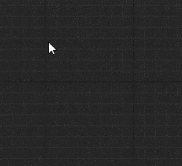

## 3. Crear Nodo Delay rápido

Mantener presionado **D** y hacer **left click** en el graph

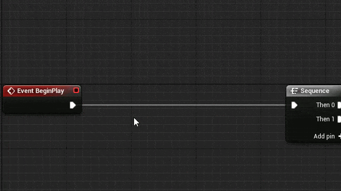

## 4. Crear Setter y Getter más rápido

- **Crear Getter más rápido:** Mantener presionado **Control** y **arrastrar** la variable al graph
- **Crear Setter más rápido:** Mantener presionado **Alt** y **arrastrar** la variable al graph

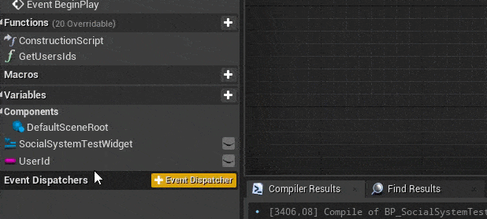

## 5. Esconder Pins no conectados de un Struct

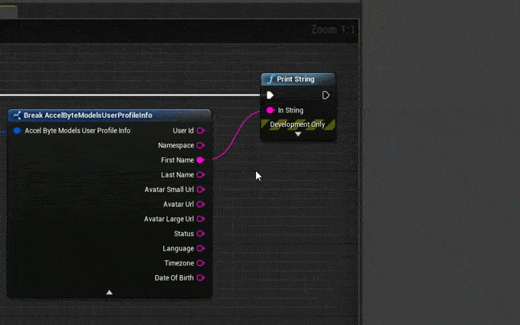

## 6. Drag para asignar Categoría

Se puede asignar la Categoría de una variable, función, etc. arrastrándola a una categoría existente.

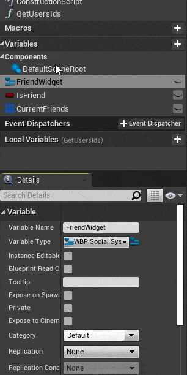

## 7. Transfer Pins

Mantener apretado **Control** para mover los pines de un nodo a otro en grupo.

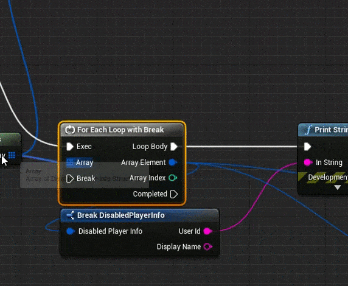

## 8. Reemplazar variable por otra

Se pueden reemplazar cierto tipo de variables por otra del mismo tipo utilizando una opción del menú contextual.

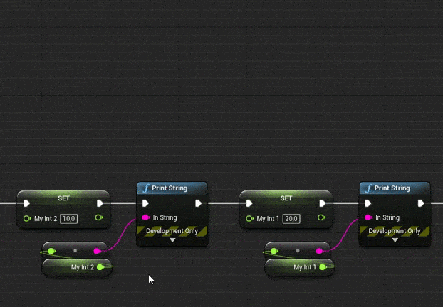

## 9. Convertir a Validated Get

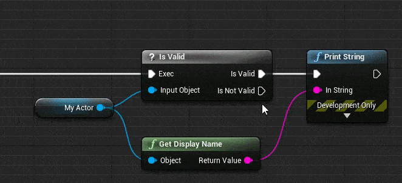

## 10. Cambiar Cast a nodo Puro

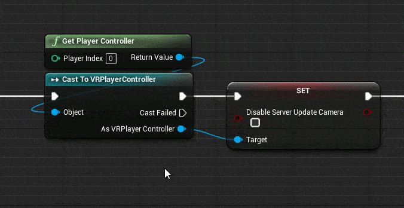

## 11. Llamar misma función en múltiples objetos

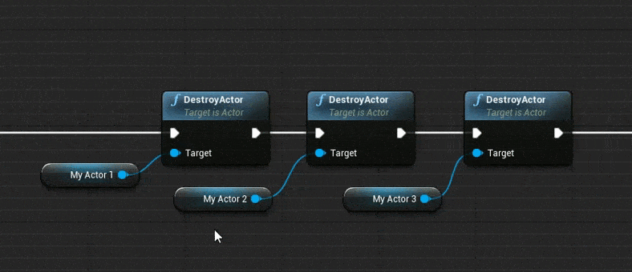

## 12. Llamar función en todos los objetos de un Array

Se puede ahorrar un nodo Foreach en el caso de que se desee llamar solo una función a todos los elementos de un array.

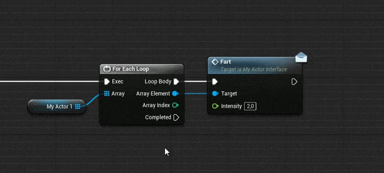

## 13. Crear Input Parameter en función arrastrando pin

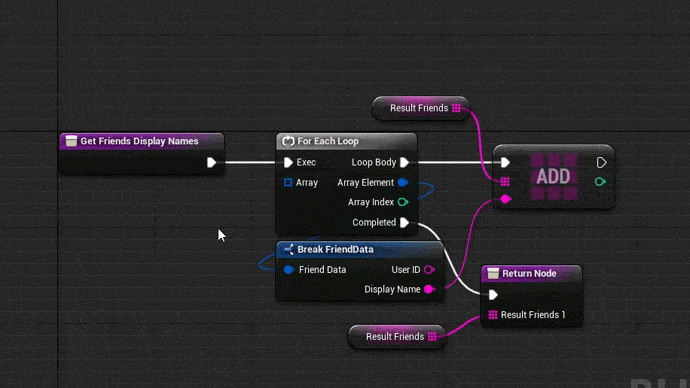

## 14. Crear Output en función arrastrando pin

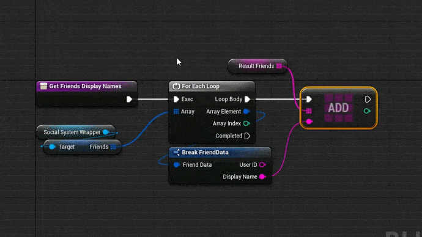

## 15. Múltiples nodos return

Es posible tener más de un nodo return en una función

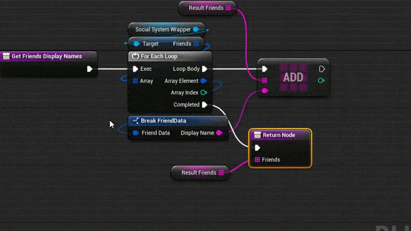
